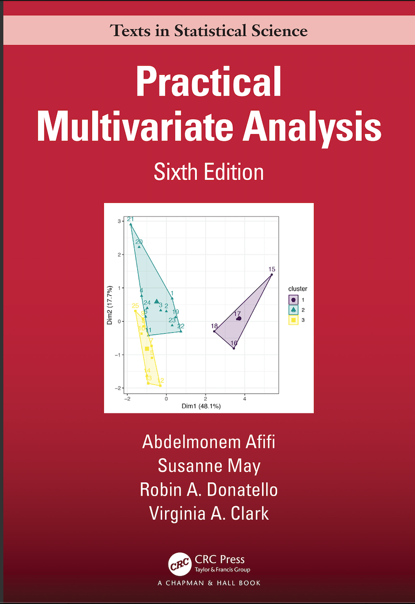

This is the sixth edition of a popular textbook on multivariate analysis. Well-regarded for its practical and accessible approach, with excellent examples and good guidance on computing, the book is particularly popular for teaching outside statistics, i.e. in epidemiology, social science, business, etc. The sixth edition has been updated with a new chapter on data visualization, a distinction made between exploratory and confirmatory analyses and a new section on generalized estimating equations and many new updates throughout. This new edition will enable the book to continue as one of the leading textbooks in the area, particularly for non-statisticians.

